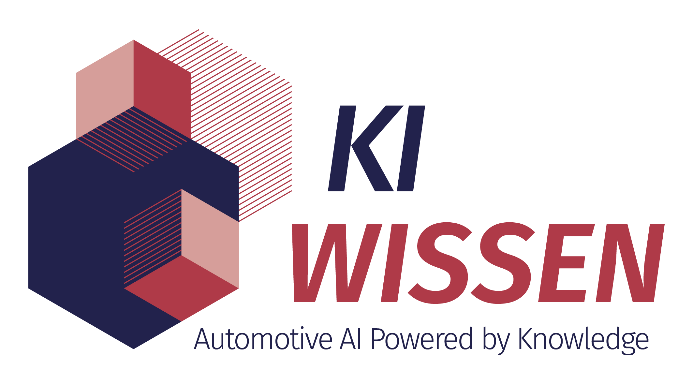
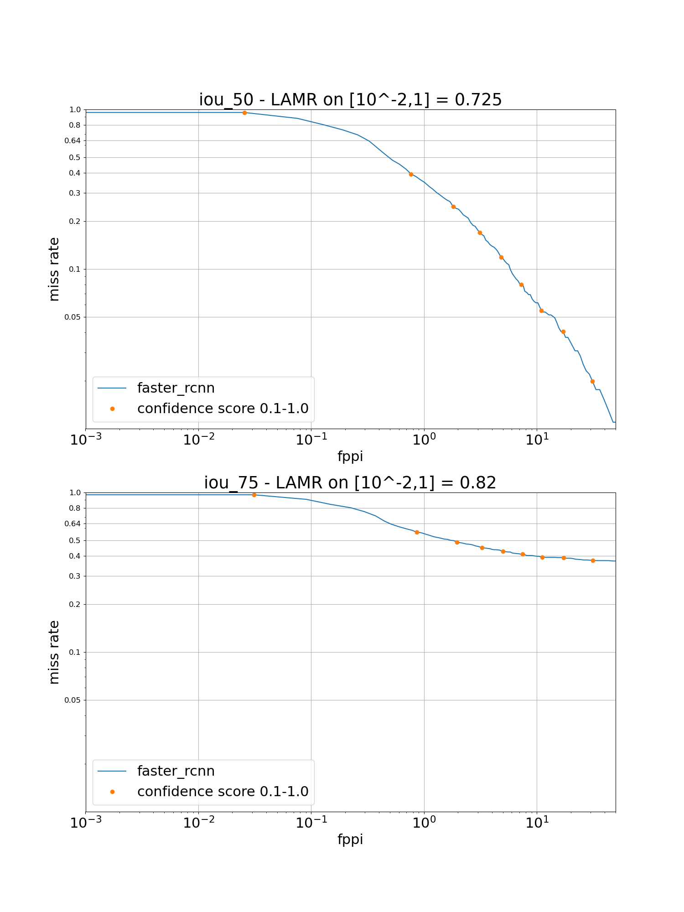

<p align="center">
  
</p>

# __FhG IAIS ML Trainer__

- [__FhG IAIS ML Trainer__](#fhg-iais-ml-trainer)
  - [__Abstract__](#abstract)
  - [__Motivation__](#motivation)
  - [__Framework Structure__](#framework-structure)
  - [__Installation__](#installation)
    - [__Conda__](#conda)
    - [__Virtualenv__](#virtualenv)
    - [__Dependency Management & Reproducibility__](#dependency-management--reproducibility)
  - [__Project Organization__](#project-organization)
  - [__Minimal Example__](#minimal-example)
    - [__Model Training__](#model-training)
      - [__Terminal Output__](#terminal-output)
    - [__Starting Tensorboard__](#starting-tensorboard)
    - [__Config Files__](#config-files)
    - [__Evaluate Trained Model__](#evaluate-trained-model)
      - [`parameters.yaml`](#parametersyaml)
      - [__fppi vs MR__](#fppi-vs-mr)
    - [__Example code for running evaluation:__](#example-code-for-running-evaluation)

## __Abstract__

Framework for __unified training of pedestrian detection models__ that implements the state-of the art methods for training object detection models like Faster R-CNN, Resnet, etc.

## __Motivation__

The motivation behind developing such a framework is three-fold:

  1. we wanted to have a framework with unified interface for training different pedestrian detection methods. In our framework the user can easily change the hyper-parameters (using YAML configuration file) of the models and the results from the training will be easily accessible;

  2. Implementation of the new pedestrian detection models and methods for integration and extraction from knowledge will be easy, structured, and safe;

  3. the correctness and soundness of our results will be guaranteed.

## __Framework Structure__

For unified training and evaluation and easy implementation of new pedestrian detection methods we define in our framework two basic concepts, _Model_ and _Model Trainer_.

__Model__. This concept is implemented as abstract class ``AModel`` in [kiwissenbase.models]. The UML diagram of the class can be find below.


Every pedestrian detection method implemented in this framework must be a child class from [kiwissenbase.models.AModel]. In order one to use all feature (training, logging, ...) of the `kiwissen-base` framework one must implement the new models as sub-class of ``AModel`` class. This abstract class defines four abstract methods that are used for the training and evaluation that needed to be implemented:

  1. ``forward()``: this methods implements the infirence of the model on a data point,
  2. ``train_step()``: the procedure executed during one training step
  3. ``validate_step``: the procedure executed during one validation step
  4. ``loss()``: definition of the loss for each specific model that will be used for training.

> For the ``transformations``  argument we bind the `Albumentations` library (<https://albumentations.ai/>). All the  tranformations available there can be used here. In order to create a transformation one has to pass a list of dictionary. Each dictonary in the list corresponds to one transformation.

Example implementation of the Faster R-CNN model can be found in [kiwissenbase.models.FasterRCNN]

__Model Trainer__.  This class is used for training models implemented in this framework. The class is handeling the model trainin, logging and booking. In order this class to be used the models must be child class from the [kiwissenbase.models.AModel]. This means that the model must implement four abstract functions from the parent class (see above).

## __Installation__

In order to set up the necessary environment:

### __Conda__

1. review and uncomment what you need in `environment.yml` and create an environment `kiwissen-base` with the help of [conda]:

   ```bash
   conda env create -f environment.yml
   ```

2. activate the new environment with:

   ```bash
   conda activate kiwissen-base
   ```

> ___NOTE:___  The conda environment will have kiwissen-base installed in editable mode.
> Some changes, e.g. in `setup.py`, might require you to run `pip install -e .` again.

### __Virtualenv__

1. Install [virtualenv] and [virtualenvwrapper].
2. Create virtualenviroment for the project:

    ```bash
    mkvirtualenv kiwissen-base
    ```

3. Install the project in edit mode:

    ```bash
    python setup.py develop
    ```

Optional and needed only once after `git clone`:

1. install several [pre-commit] git hooks with:

   ```bash
   pre-commit install
   # You might also want to run `pre-commit autoupdate`
   ```

   and checkout the configuration under `.pre-commit-config.yaml`.
   The `-n, --no-verify` flag of `git commit` can be used to deactivate pre-commit hooks temporarily.

2. install [nbstripout] git hooks to remove the output cells of committed notebooks with:

   ```bash
   nbstripout --install --attributes notebooks/.gitattributes
   ```

   This is useful to avoid large diffs due to plots in your notebooks.
   A simple `nbstripout --uninstall` will revert these changes.

Then take a look into the `scripts` and `notebooks` folders.

### __Dependency Management & Reproducibility__

1. Always keep your abstract (unpinned) dependencies updated in `environment.yml` and eventually
   in `setup.cfg` if you want to ship and install your package via `pip` later on.
2. Create concrete dependencies as `environment.lock.yml` for the exact reproduction of your
  environment with:

```bash
conda env export -n kiwissen-base -f environment.lock.yml
```

   For multi-OS development, consider using `--no-builds` during the export.
3. Update your current environment with respect to a new `environment.lock.yml` using:

```bash
conda env update -f environment.lock.yml --prune
```

## __Project Organization__

```
├── AUTHORS.md              <- List of developers and maintainers.
├── CHANGELOG.md            <- Changelog to keep track of new features and fixes.
├── CONTRIBUTING.md         <- Guidelines for contributing to this project.
├── Dockerfile              <- Build a docker container with `docker build .`.
├── LICENSE.txt             <- License as chosen on the command-line.
├── README.md               <- The top-level README for developers.
├── configs                 <- Directory for configurations of model & application.
├── data
│   ├── external            <- Data from third party sources.
│   ├── interim             <- Intermediate data that has been transformed.
│   ├── processed           <- The final, canonical data sets for modeling.
│   └── raw                 <- The original, immutable data dump.
├── docs                    <- Directory for Sphinx documentation in rst or md.
├── environment.yml         <- The conda environment file for reproducibility.
├── models                  <- Trained and serialized models, model predictions,
│                              or model summaries.
├── notebooks               <- Jupyter notebooks. Naming convention is a number (for
│                              ordering), the creator's initials and a description,
│                              e.g. `1.0-fw-initial-data-exploration`.
├── pyproject.toml          <- Build configuration. Don't change! Use `pip install -e .`
│                              to install for development or to build `tox -e build`.
├── references              <- Data dictionaries, manuals, and all other materials.
├── reports                 <- Generated analysis as HTML, PDF, LaTeX, etc.
│   └── figures             <- Generated plots and figures for reports.
├── scripts                 <- Analysis and production scripts which import the
│                              actual PYTHON_PKG, e.g. train_model.
├── setup.cfg               <- Declarative configuration of your project.
├── setup.py                <- [DEPRECATED] Use `python setup.py develop` to install for
│                              development or `python setup.py bdist_wheel` to build.
├── src
│   └── kiwissenbase        <- Actual Python package where the main functionality goes.
├── tests                   <- Unit tests which can be run with `pytest`.
├── .coveragerc             <- Configuration for coverage reports of unit tests.
├── .isort.cfg              <- Configuration for git hook that sorts imports.
└── .pre-commit-config.yaml <- Configuration of pre-commit git hooks.
```

## __Minimal Example__

### __Model Training__

To train a model, use the script `scripts/train_model.py`. Which model to train, specific parameters and data/output directories are provided by `config.yaml`
files. See section [__Config Files__](#config-files) for details.

Train a model from a config by `python scripts/train_model.py --config path/to/config.yaml`. We provide some default config files:

- `configs/caltech/faster_rcnn.yaml`:
  Train Faster R-CNN model on the Caltech dataset
- ...

Additional arguments to `scripts/train_model.py`:

- `--quiet / --verbose / --very-verbose`:
  Set log-level, i.e. number of logging messages shown during training.
- `-d / --debug`: Use to disable multiprocessing entirely. Useful for debugging.
- `-nc / --no-cuda`: Use to disable GPU-usage entirely. Useful for debugging.
- `--resume-training`: Use to resume a previous training.
- `--resume-from`: Provide save directory of previous training for resuming.

#### __Terminal Output__


### __Starting Tensorboard__

In the framework we provide out of the box tensorboard logging. In order to see the training progress in tensorboard, first you need to start the tensorboard:

```bash
tensorboard --logdir results/logging/tensorboard
```


### __Config Files__

For reproducibility and tractability of the experiments done as well as for convenience we store all the models' hyperparameters into a __yaml__ config file.
All of the configuration files used to train the models are stored in `configs` folder. Each configuration file contains 5 main parts. The first part of the
yaml configuration file is:

```yaml
name: faster_rcnn_caltech
num_runs: 1
num_workers: 0
world_size: 1
distributed: false
gpus: !!python/tuple ["0"]
seed: 1
```

- `name:` Key holds the name of the experiment. The user can use any name that finds suitable for the experiment.
- `num_runs:` Number of times the experiment will be repeated.
- `num_works:` How many processes should be used for the training.
- `gpus:` Which gpus to be used.
- `seed:` Value of the initial seed.

The second part of the configuration file is the model.

```yaml
model:
  module: kiwissenbase.models.object_detection.faster_rcnn
  name: FasterRCNN
  args:
    backbone: resnet50_fpn
    num_classes: 2
    min_size: 1150
    max_size: 2300
    transformations: !!python/tuple
      - module: albumentations
        name: ToFloat
        args:
          max_value: null
          p: 1

```

In this part the user can define which model will be used for the training as well as the hyperparameters. In the example above, we use __FasterRCNN__ model. In order to do that we have supply the `module: kiwissenbase.models.object_detection.faster_rcnn` the python package where the model is and the `name: FasterRCNN` name of the model. Next, in the `arg` key we set the all hyperparameters needed for the specific model. For the ``transformations`` argument we bind the `Albumentations` library (<https://albumentations.ai/>). All the tranformations available there can be used here. In     order to create a transformation one has to pass a list of dictionary. Each dictonary in the list corresponds to one transformation.

The third part of the yaml file is the data loader part.

```yaml
data_loader:
  module: kiwissenbase.data.dataloaders
  name: CaltechPedastrianDataLoader
  args:
    root_dir: ./data/
    subset: annotated-pedestrians # ['all', 'annotated', 'annotated-pedestrians']
    batch_size: 16
    different_size_target: True # not all images have equal number of objects
    validation_batch_size: 16
    num_workers: 4
    pin_memory: true
    group_pedestrian_classes: true
    train_transform:
      min_area: 1024
      min_visibility: 0.1
      transformations: !!python/tuple
        - module: albumentations
          name: HorizontalFlip
          args:
            p: 0.5
```

The forth part is the optimizer that we are going to use during the training.

```yaml
optimizer:
  min_lr_rate: 1e-8
  gradient_norm_clipping: 0.25
  module: torch.optim
  name: Adam
  args:
    lr: 0.001
```

The last part that we have to define is the _trainer_. In this part we set all the parameters that are used for training and logging.

```yaml
trainer:
  module: kiwissenbase.trainer
  name: BaseTrainingProcedure
  args:
    bm_metric: MR
    iou_thresh: 0.5
    save_after_epoch: 1
    eval_test: false
    lr_schedulers: !!python/tuple
      - optimizer: # name of the optimizer
          counter: 1 # anneal lr rate if there is no improvement after n steps
          module: torch.optim.lr_scheduler
          name: StepLR
          args:
            step_size: 3
            gamma: 0.2
    schedulers: !!python/tuple
      - module: kiwissenbase.utils.param_scheduler
        name: ExponentialScheduler
        label: beta_scheduler
        args:
          max_value: 1.0
          max_steps: 5000
          decay_rate: 0.0025
  epochs: 18
  save_dir: ./results/saved/ # directory where the model will be stored (best_model and checkpoint models)
  logging:
    logged_train_stats: # metrcis to be logged for the train set
      !!python/tuple [
        "loss",
        "loss_objectness",
        "loss_rpn_box_reg",
        "loss_classifier",
        "loss_box_reg",
      ]
    logged_val_stats: # metrcis to be logged for the val set
      !!python/tuple [
        "MR_reasonable",
        "MR_small",
        "MR_occlusion",
        "MR_all",
        "fn_reasonable",
        "n_targets_reasonable",
        "fppi_reasonable",
        "fp_reasonable",
        "n_imgs",
      ]
    logged_test_stats: # metrcis to be logged for the test set
      !!python/tuple [
        "MR_reasonable",
        "MR_small",
        "MR_occlusion",
        "MR_all",
        "fn_reasonable",
        "n_targets_reasonable",
        "fppi_reasonable",
        "fp_reasonable",
        "n_imgs",
      ]
    tensorboard_dir: ./results/logging/tensorboard/ # location of the Tensorboard logging dir
    logging_dir: ./results/logging/raw/
    formatters:
      verbose: "%(levelname)s %(asctime)s %(module)s %(process)d %(thread)d %(message)s"
      simple: "%(levelname)s %(asctime)s %(message)s"
```

In this library we have an object that is called _Trainer_ that is responsible for training the models and logging and creating checkpoints during training.

### __Evaluate Trained Model__

To evaluate a trained model, use the script `scripts/evaluate_model.py`. In order a model to be evaluated we need at least to _provide path to the trained model_, _path to the dataset root directory_ and the _output directory_, where the results will be stored. The script will create new dirctory with name that is concatination of the experiment name and the dataset split on which we want to evaluate the mode. Inside the folder four files are create: `model.pth` (copy of the trained model, see below for the structure), `parameters.yaml` (hyper-parameters of the experiment), `results.json` (aggregate and per image metrics), and `mr-fppi.png` (miss rate versus false positive per image curve for IoU 50% and IoU 75%, see image below).

#### `parameters.yaml`

```json
{
  "predictions": [
    {
      "id": 0,
      "img_path": "path/to/the_image.jpeg",
      "img_name": "the_image",
      "prediction": {
        "boxes": [[x1, y1, x2, y2] ...],
        "labels": [0, 1, 0, ...],
        "scores": [0.99, 0.81, 0.58, ...],
      },
      "targets": {
        "boxes": [[x1, y1, x2, y2] ...],
        "labels": [1, 1, 0, ...],
        "boxesVisRatio": [...],
        "boxesHeight": [...]
      },
      "num_targets": n,
      "iou_50": [
        {
          "category": "reasonable",
          "fn": [...],
          "fp": [...]
        },
        {
          "category": "small",
          "fn": [...],
          "fp": [...]
        },
        {
          "category": "oclusion",
          "fn": [...],
          "fp": [...]
        },
        {
          "category": "all",
          "fn": [...],
          "fp": [...]
        },
      ],
      "iou_75": [
        ...
      ]
    }
  ],
  "aggregated_metrics": {
      "iou_50": [
        ...
      ],
      "iou_75": [
        ...
      ]
  }

}

```

#### __fppi vs MR__

<p align="center">
  
</p>

### __Example code for running evaluation:__

 ```bash
 python scripts/evaluate_model.py --model_dir path/to/model.pth --split [train|validate|test] --data-root-dir path/to/data_dir --output-dir path/to/output_dir
 ```

Additional arguments to `scripts/evaluate_model.py`:

- `--evaluation-custom-name`: Custom name for the folder where the evaluation will be stored. If not provided the name of the folder will be `experiment_name` + `dataset split`
- `--gpus`: GPUs used for evaluation.
- `--num-workers`: Number of threads used for the evaluation.
- `--quiet / --verbose / --very-verbose`: Set log-level, i.e. number of logging messages shown during training.
- `-d / --debug`: Use to disable multiprocessing entirely. Useful for debugging.
- `-nc / --no-cuda`: Use to disable GPU-usage entirely. Useful for debugging.

[conda]: https://docs.conda.io/
[kiwissenbase.models]: src/kiwissenbase/models/__init__.py
[kiwissenbase.models.AModel]: src/kiwissenbase/models/__init__.py
[kiwissenbase.models.FasterRCNN]: src/kiwissenbase/models/object_detection/faster_rcnn.py#16
[pre-commit]: https://pre-commit.com/
[nbstripout]: https://github.com/kynan/nbstripout

<!-- ## NOTE

- Because the project is run on different servers (weizebaum and warpcore1) thus the root_dir of data_loader in config yaml files might need to be changed depending on where you store the dataset.
- To avoid conflict during working together on gitlab, you should:
  - firstly pull the latest develop branch to local
  - rebase develop to your branch, fix some possible conflicts
  - merge your branch to develop on local
  - push them to gitlab -->
